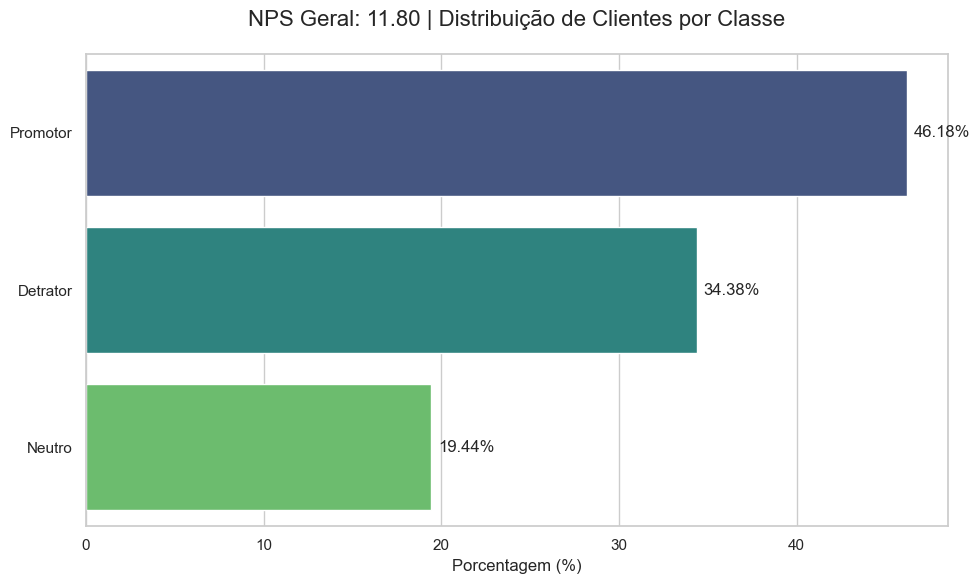
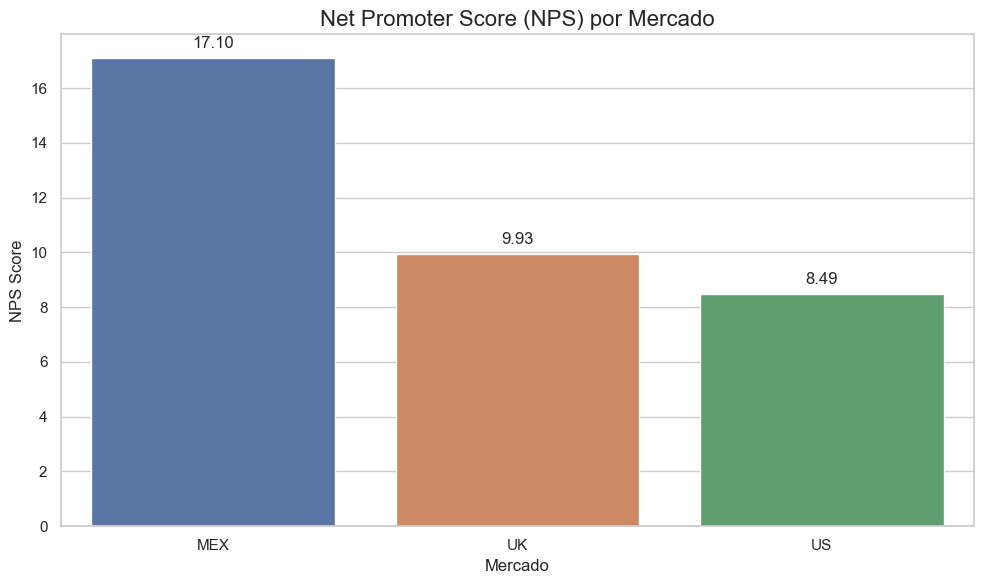
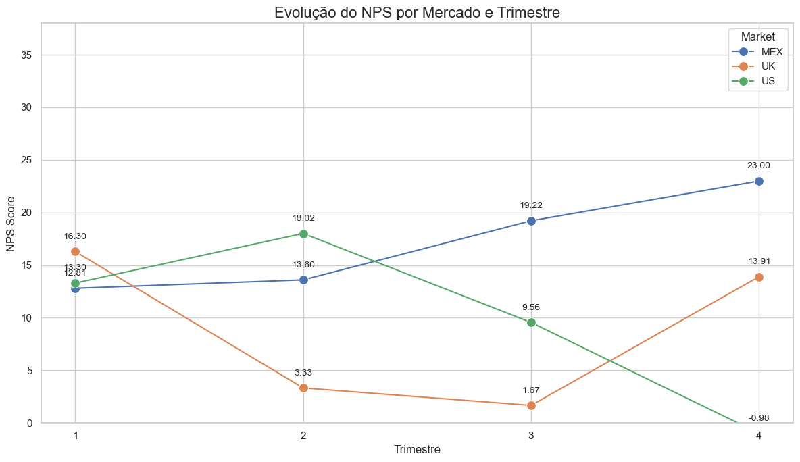
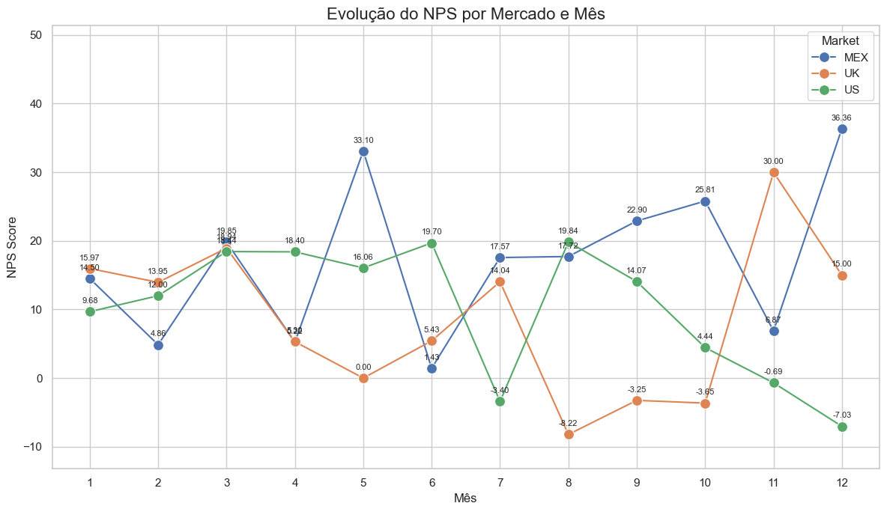

# NPS for financial services

# DOCUMENTAÇÃO

---

- **Informações Gerais**
    - **Título do Dataset:** NPStimeseries.csv
    - **Fonte:** https://www.kaggle.com/datasets/charlottetu/npsbank?resource=download
    - **Período dos Dados:** janeiro de 2021 a  dezembro de 2021
    - **Contexto:** A defesa do cliente (advocacy) é importante para qualquer negócio. Clientes satisfeitos geram mais receita e têm menos probabilidade de desistir. No entanto, há uma falta de dados de NPS publicamente disponíveis.
    - **Conteúdo:** Este é um dataset de 2021, gerado usando distribuições reais de dados de NPS de um banco de varejo.

- **Título e Objetivo da Análise:**
    - O objetivo principal é avaliar o desempenho do NPS da empresa em diferentes mercados (EUA, Reino Unido, México). A análise também visa identificar a distribuição de clientes promotores, neutros e detratores ao longo dos meses e trimestres para cada região.

- **Dicionário de Variáveis (Colunas)**

| Variável | Descrição |
| --- | --- |
| **ID** | Identificador único para cada resposta da pesquisa. |
| **Market** | Mercado ou região geográfica do cliente (ex: US, MEX, UK). |
| **Survey date** | Data em que o cliente respondeu à pesquisa. |
| **Customer Name** | Nome do cliente que respondeu à pesquisa. |
| **Month** | Mês em que a pesquisa foi respondida. |
| **Quarter** | Trimestre do ano em que a pesquisa foi respondida. |
| **NPS** | Nota do Net Promoter Score dada pelo cliente (de 0 a 10). |
| **Class** | Classificação do cliente com base na nota do NPS (Promotor, Neutro ou Detrator). |
- **Carregamento e verificação dos dados:**
    - Inicialmente os dados foram tratados em PowerQuery, e também foi inserida uma nova coluna de `Class` utilizando fórmula de lógica `=if` para definir promotores, neutros e detratores.
    
- Requirements:
    - **pandas**
    - **matplotlib**
    - **seaborn**
    - **openpyxl**

# ANÁLISE EXPLORATÓRIA

### **1. Performance Geral**

A análise inicial de 5.000 respostas de clientes mostrou que a performance geral do NPS da empresa em 2021 está na faixa **"Justo"** a **"Bom"**. O NPS geral é de **11.80**, um resultado que, apesar de positivo, sugere oportunidades de melhoria.

**Distribuição de Clientes por Classe**
O total de clientes está distribuído da seguinte forma:

| Classe | Contagem | Porcentagem |
| --- | --- | --- |
| Promotores | 2.309 | 46.18% |
| Neutros | 972 | 19.44% |
| Detratores | 1.719 | 34.38% |

A grande proporção de detratores e o NPS baixo reforçam a importância de uma análise mais aprofundada para entender as causas.

---

### **2. Análise por Mercado**

A segmentação dos dados revelou que o NPS varia significativamente entre os mercados, com cada região apresentando uma performance distinta.

- Média anual:

- Performance por trimestre:

**NPS Score por Mercado**

| Mercado | NPS Score |
| --- | --- |
| MEX | 23.00 |
| UK | 13.91 |
| US | -0.98 |

Apesar do NPS geral positivo, o mercado dos **EUA** apresenta um score negativo, o que indica uma área crítica que precisa de atenção imediata.

---

### **3. Análise de Tendência Temporal Detalhada**

Para entender a origem das discrepâncias, a análise foi aprofundada para o nível mensal. As tendências revelam o momento exato das mudanças na satisfação do cliente em cada mercado.

- **Evolução do NPS por Mercado e Mês**

    

| Mês | MEX | UK | US |
| --- | --- | --- | --- |
| 1 | 14.50 | 15.97 | 9.68 |
| 2 | 4.86 | 13.95 | 12.00 |
| 3 | 19.85 | 18.94 | 18.44 |
| 4 | 5.22 | 5.30 | 18.40 |
| 5 | 33.10 | 0.00 | 16.06 |
| 6 | 1.43 | 5.43 | 19.70 |
| 7 | 17.57 | 14.04 | -3.40 |
| 8 | 17.72 | -8.22 | 19.84 |
| 9 | 22.90 | -3.25 | 14.07 |
| 10 | 25.81 | -3.65 | 4.44 |
| 11 | 6.87 | 30.00 | -0.69 |
| 12 | 36.36 | 15.00 | -7.03 |

---

### **4. Conclusões Principais**

A análise detalhada nos permite tirar as seguintes conclusões:

- **MEX: Liderança e Volatilidade**: O mercado do México demonstra uma forte tendência de crescimento, terminando o ano com o maior NPS de todos. A volatilidade sugere que a performance foi influenciada por eventos pontuais.
- **UK: Crise e Recuperação**: O Reino Unido passou por uma queda drástica na metade do ano, mas teve uma recuperação notável, com um aumento significativo no NPS em novembro. Investigar o que causou essa virada pode fornecer lições valiosas.
- **US: Sinais de Alerta**: A performance do mercado dos EUA começou a decair em **maio**, muito antes do score se tornar negativo em **julho**. O NPS negativo nos meses seguintes é um sinal de que a insatisfação está crescendo.

### 3. Recomendações & Próximos passos

- **Para o Mercado dos EUA  (Crise):** O foco principal é a **recuperação**. É urgente entender a "causa-raiz" da queda do NPS.
    - **Pesquisa com Detratores e Neutros**: O objetivo é conduzir entrevistas de aprofundamento ou enviar pesquisas curtas e direcionadas para entender o que motivou a insatisfação. Perguntas-chave seriam sobre a experiência nos meses de maio a julho: houve um problema com o atendimento, com a usabilidade do aplicativo, com taxas ou com a comunicação?
- **Para o Mercado do Reino Unido (a Virada):** O foco é a **reforçar o sucesso**. O salto no NPS é uma mina de ouro de insights.
    - **Pesquisa com Promotores**: O objetivo é entender o que deu certo. O que os fez mudar de opinião? O que os fez se sentirem tão bem em outubro/novembro? O que podemos aprender com essa experiência para replicá-la em outros mercados ou para todos os clientes?
- **Para o Mercado do México:** Foco em **acelerar e reter**.
    - **Pesquisa com Promotores e "Super-fãs"**: O objetivo é identificar os "advogados da marca" e entender profundamente os motivos da lealdade. O que a empresa faz de melhor? O que os faria sair? Esses insights são valiosos para refinar a proposta de valor e aprimorar a experiência para clientes-chave.
